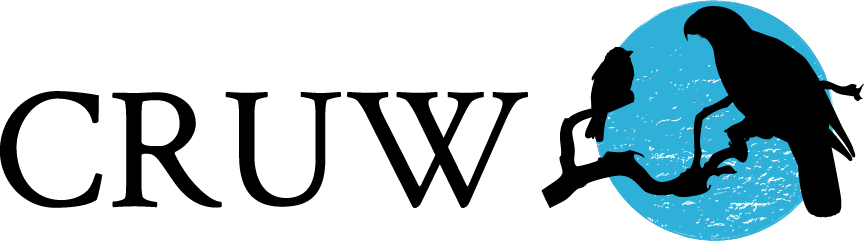
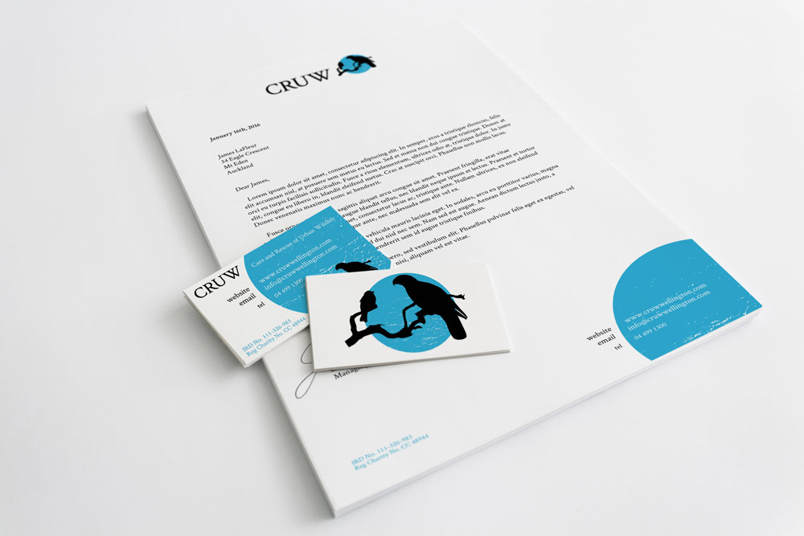
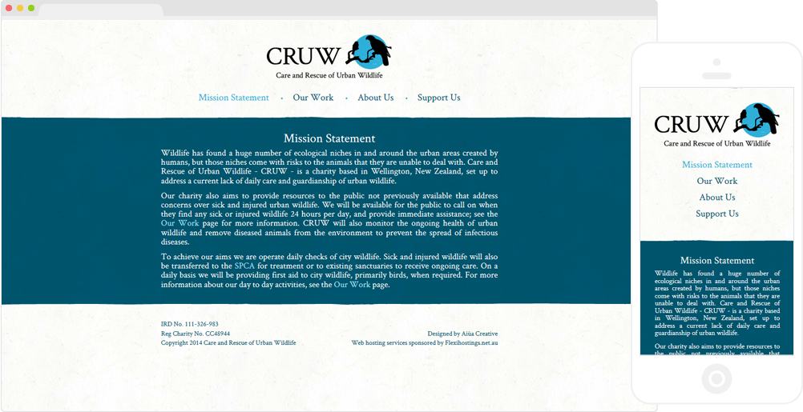
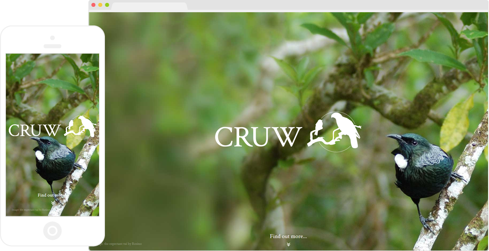

CRUW is a small charity based in Wellington, New Zealand, dedicated to the care and rescue of urban wildlife. As a new charity they had been using a stock image of a sparrow as their logo, and wanted a new identity which would be unique, simple, and stylish, and which would represent their care for the native and introduced species found in their area.

    

The logo I created includes silhouettes of two birds: a sparrow and a kaka. Sparrows are a species introduced to New Zealand by Europeans, whereas kaka are native to the country, so the two combined are a great representation of the inclusive nature of the charity. I used Illustrator to create the logo, combining a clean and crisp silhouette with a textured background to add a little more character.

I also developed a set of stationery using elements from the logo.

    

Finally, I developed a fairly basic website for the charity, since the client wanted to have a web presence but did not want to spend too much time maintaining it. As with the stationery, I used the aesthetic of the logo to inform the design of the site, keeping it simple while evoking a rough and tactile feel. I hand-coded the site mostly using HTML, with a small amount of PHP for repeated elements.

    

To put the birds front and center, we added a splash section to the homepage, which features another bird native to New Zealand--a Tui--and the single-colour version of the logo. The simple interaction used here was written using jQuery.
