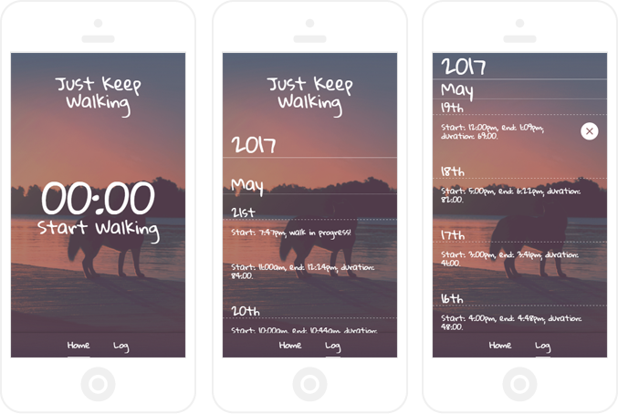

My wife tries to keep track of how much time we spend walking our dog--we have a husky, so it's a <em>lot</em> of walking--but the apps available never quite fit what she wants.

They're usually too complex and often require geolocation, whereas she just wants to be able to track the amount of time without worrying about data usage or anything else. Another option would be a stopwatch app, but they're usually too simple.

It was a perfect opportunity to use some tech that I had been learning; <strong>Just Keep Walking</strong> is the result!

It's a simple walk tracking app, built using <a href="https://facebook.github.io/react/" target="_blank">React</a>, with an IndexedDB database interacted with via <a href="http://dexie.org/" target="_blank">Dexie</a>.

The features so far are a stopwatch-style counter on the homepage, tap to start/end a walk, and a log page listing previous walks, including a delete walk function. I've also configured the webpack offline-plugin so that the app is available when disconnected from the internet as a progressive web app.

*Note: once I have some time I intend to re-create this using React Native!*
