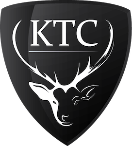
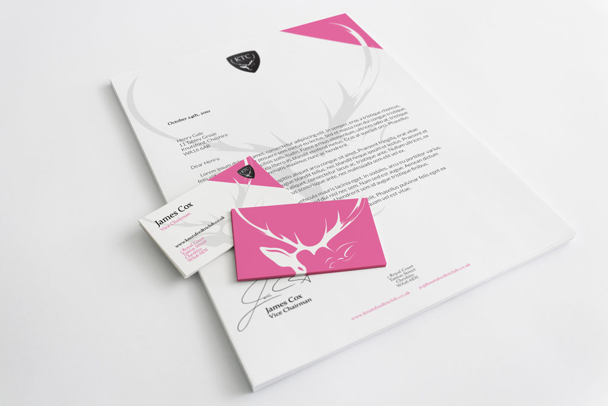

The Knutsford Triathlon Club wanted an identity design to help foster a sense of respectability, culture, and pride in their community. Their ideal logo would incorporate some kind of representation of the Knutsford area, and ideally some form of a shield shape to help combine a modern aesthetic with a sense of tradition. They specified a colour scheme of black, white, and pink.

One of the most iconic cultural places in Knutsford is Tatton Park, a stately home with extensive grounds populated by herds of deer. The public footpaths within the grounds are a popular exercise location, so some form of reference to the park would make a natural centerpiece for the logo. I decided that the image of a stag would be a perfect fit.

    

I used Illustrator to create the logo, combining a clean and simple shield shape with the club's initials and the stag icon. After discussion with the client, we concluded that the shield itself should be black and white only, with the pink accent colour brought in elsewhere in the branding. The simplicity of the logo means it is instantly recognisable, and works perfectly on clothing prints such as those shown on <a href="http://www.knutsfordtriclub.co.uk/" target="_blank">their website</a>.

Finally, I created some stationery which fit with the modern image the club wanted to portray, and prominently featured their trademark pink colour.
