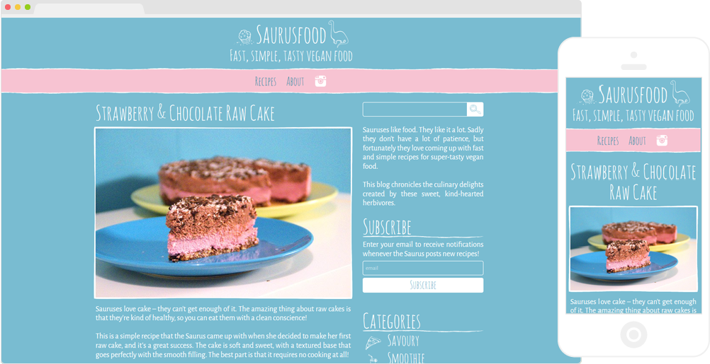
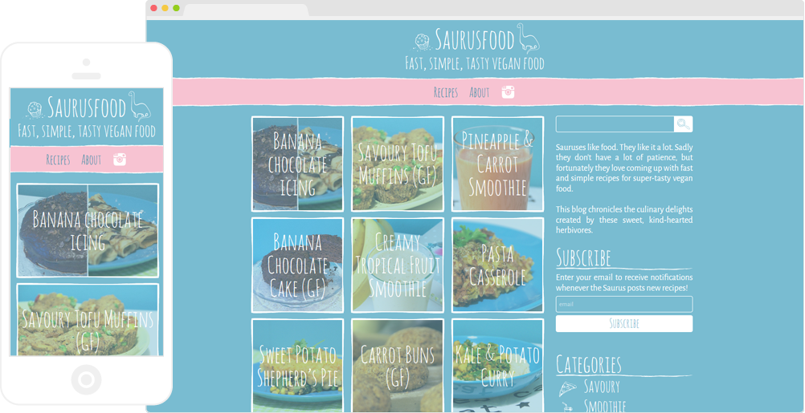

A responsive recipe blog using the WordPress platform.

    

We developed a quirky and fun identity for the blog, with a varied set of illustrations, and from there I designed and developed the site to fit the clean but whimsical style desired.

    

As one of the main goals of the site was for it to be as clean and simple as possible, I used the <a href="https://wordpress.org/themes/blankslate/" target="_blank">BlankSlate</a> theme as a base, which provides as much development freedom as possible. I kept the markup structure simple and logical while allowing for design flair to be added via CSS.

The recipes were added using the <a href="https://wordpress.org/plugins/wp-ultimate-recipe/" target="_blank">WP Ultimate Recipe</a> plugin, which provides the ideal functionality for a recipe blog.

    

The site was built using a mobile-first philosophy, which ensures that it looks good and functions well on all devices.
