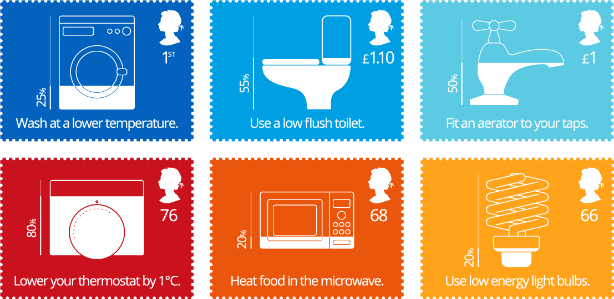
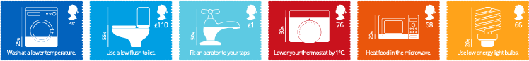

The brief was to create a set of six stamps which encourage people to make small changes in their own lives which would help the environment. They had to work equally well as individual stamps and as a set of six, and must also work well both at a large size and at the actual size of a stamp.

	

First I conducted some research, looking for some different facts and figures which could be worked into a cohesive set. I found a huge range of information, and selected some statistics which matched in terms concept and phrasing.

The chosen statistics all show the percentage of the total output saved when the step described in the text is taken, as detailed below:

<ul>
	<li><strong>Washing Machine:</strong>  Washing at a lower temperature can reduce energy use by 75%.</li>
	<li><strong>Toilet:</strong>  Using a low flush toilet can reduce water use by 45%.</li>
	<li><strong>Tap:</strong>  Fitting an aerator to taps can reduce water use by 50%.</li>
	<li><strong>Thermostat:</strong>  Turning your thermostat down by 1 degree centegrade can reduce energy use by 20%.</li>
	<li><strong>Microwave:</strong>  Heating food in a microwave instead of a conventional oven can reduce energy use by 80%.</li>
	<li><strong>Light Bulbs:</strong>  Using low energy light bulbs can reduce energy use by 80%.</li>
</ul>

Once I had a cohesive set of facts which I felt worked well together, I created the stamps using Illustrator. I aimed for a crisp, clean and clear visual style which catches the eye with its bright colours, and communicates the information very effectively. The style also reflects the perception of environmentally friendly technology as clean and modern, which would further entice people to take part.

	

