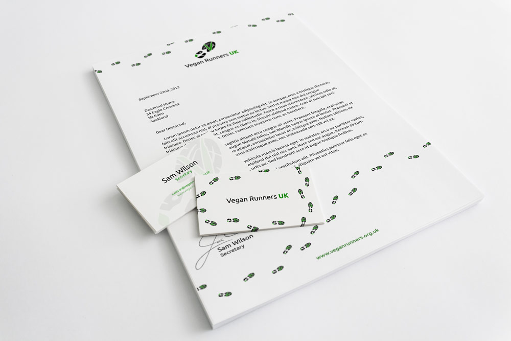

Vegan Runners UK wanted an identity design to help make their brand attract more notice and look both professional and playful. Their ideal logo would incorporate imagery related to both running and veganism. They wanted something that felt modern, and wanted to retain their existing black and green colour scheme.

    

The solution was obvious: the tread of a running shoe, with a V representing veganism worked into the print. I also replaced part of the tread with a leaf silhouette, and used a sans-serif typeface to give the logo a modern feel. The leaf, the V, and the UK were all perfect opportunities to add the colour to the logo. I used Illustrator to create the logo, ensuring that it would work well at a wide variety of sizes in many different applications.

Finally, I created some stationery which fit with the professional yet playful brand of the club.
