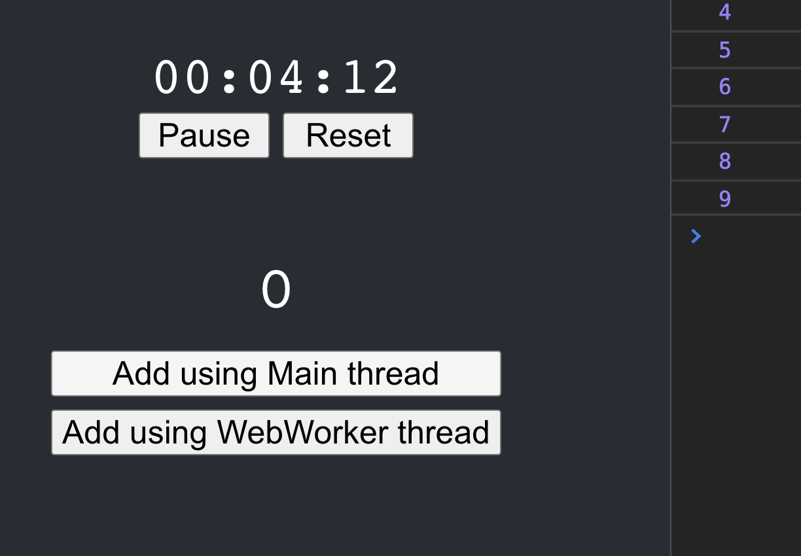

For a language upon which the whole front-end world is set, it came as a surprise to me that Javascript is single-threaded. That's right! Every single tab of your browser is run by Javascript running on a single thread. That includes all the rendering, ajax requests, event listeners, setIntervals, heck even the console. The CPU time of that single thread is divided between all these to provide us a seamless experience, so-much-so that we even forget this limitation.

Javascript runs fine on a single thread. But if it gets stuck in any CPU intensive task, its ability to render and manipulate DOM gets hampered. Now, this is very rare, because on most occasions, the UI receives the data from the backend in a form that is ready to display. But sometimes, the requirement calls for your web-app to process some data (sorting, computation, etc.). If this data is big, it can lead to a laggy or even an unresponsive UI as the main thread is busy computing.


This is where Web Workers come in. Web workers allow us to run our own scripts in the background on a different thread. Now, it's not as magical as it sounds, as background scripts don't have access to DOM, or any imported components or libraries. But it will solve our problem very well:

* The main script running in the foreground handling all the DOM manipulation.
* A background worker script handling all the heavy processing.

For running some code in web workers, it must be provided as a separate JS file. This is because our main-script and web-worker script must be completely independent so that they can run on separate threads. But then, how will they communicate? The window.postMessage() method safely enables cross-origin communication. Thus, the two scripts will communicate by sending(posting) and receiving(listening) messages.

---

### Enough theory, Lets code!

I have a basic stop-watch react app which I think will be perfect for this demonstration. You can find the complete code at Github. The demo is live here.

Let’s start by creating the script that’ll run in the background. The heavy computation task we are gonna do is nested for loops incrementing a value. We’ll add an event listener to listen to messages from the main-script and send the result back using postMessage

```jsx
export default () => {
  // eslint-disable-next-line no-restricted-globals
  self.addEventListener("message", (e) => {
    if (!e) return;
    let score = e.data;
    let toAdd = 0;
    for (let i = 0; i < 10000; i++) {
      for (let j = 0; j < 100000; j++) {
        toAdd++;
      }
    }
    postMessage(score + toAdd);
  });
};
```

I have just passed a single value here “score”. You can pass arrays, objects, etc. as well.

> postMessage() always sends a copy of your data. Thus, there will be a noticible performance drop if the message size is >100MB.

But wait, we have to provide incrementWorker.js as a separate file. This will require excluding it from our existing build workflow and converting it to ES5 and then referencing its URL to create our Worker … and many more hassles. Any workarounds? Yes! Its called Blob.

Blobs allow us to create temporary files whose URL can referenced using URL.createObjectURL(). Its constructor takes an array of values. Even if we have just one string to put in the blob, we must wrap it in an array.

Let's create a WebWorker class that does all this for us and returns a nice worker for us to use.

```jsx
export default class WebWorker {
  constructor(worker) {
    const code = worker.toString();
    const blob = new Blob(["(" + code + ")()"]);
    return new Worker(URL.createObjectURL(blob));
  }
}
```

We enclosed our code in (...)() so that the script is executed as soon as it's mounted. Thus our web-worker script starts listening to messages right away!

Now, all we need to do is create a WebWorker object with the incrementWorker.js script

```jsx
import WebWorker from "./components/WebWorker/WebWorker";
import incrementWorker from "./utils/incrementWorker";

class App extends React.Component {
  worker = new WebWorker(incrementWorker);

  ...
```

Remember, we still need to post messages & add a listener to receive messages from incrementWorker.js in our main code. Let’s do that now.

```jsx
import React, { useEffect, useState } from "react";

import "./styles.css";

// We passed the worker from app.js
const WebWorkerDemo = ({ worker }) => {
  const [score, setScore] = useState(0);
  const [loading, setLoading] = useState(false);

  // Add event listener to listen to messages from web-worker script
  useEffect(() => {
    worker.addEventListener("message", (event) => {
      setScore(event.data);
      setLoading(false);
    });
  }, []);

  // Same code as incrementWorker.js but in main-script
  // Will be used to illustrate the difference in performance in the Demo application
  const incrementWithoutWorker = () => {
    setLoading(true);
    let toAdd = 0;
    for (let i = 0; i < 10000; i++) {
      for (let j = 0; j < 100000; j++) {
        toAdd++;
      }
    }
    setScore((score) => score + toAdd);
    setLoading(false);
  };

  // Post messages to web-worker script
  const incrementWithWorker = () => {
    setLoading(true);
    worker.postMessage(score);
  };

  return (
    <div className="web-worker-demo">
      <div className={loading ? "score loading" : "score"}>{score}</div>
      <div className="demo-buttons">
        <button onClick={incrementWithoutWorker} disabled={loading}>
          Add using Main thread
        </button>
        <button onClick={incrementWithWorker} disabled={loading}>
          Add using WebWorker thread
        </button>
      </div>
    </div>
  );
};

export default WebWorkerDemo;
```

When the incrementWithWorker function is called, we post a message to the incrementWorker.js script by

```jsx
worker.postMessage(score);
```

The worker processes and messages us back the result which we listen via the eventListener we added in the useEffect upon initial mount.

---

### Let's checkout the Demo now!

First, we’ll test out what happens when we try to compute using the Main thread. Start the stop-watch and click “Add using Main thread”

The following observations are made:

1. The stop-watch stops for a few moments.
2. The console has incrementing numbers every 500ms. That stops for a while.
3. As per the code, while calculating the score, loading=true, so buttons should be disabled and the score must be greyed out. But that does not happen.



Let's try now using our worker script. Click “Add using WebWorker thread”.

It works just as expected. None of the 3 points mentioned above are noticed here. Hurrah!!!

---
> You can never create your web-app completely multi-threaded. But with Web Workers, it's possible to transfer the CPU intensive work to 1 or even more background scripts. This will ensure your main script is always ready to respond to the user providing a lag-free snappy experience. And that’s the end-goal in front-end development, isn’t it?

Thank You for reading this far. Hope it was worth your time.

