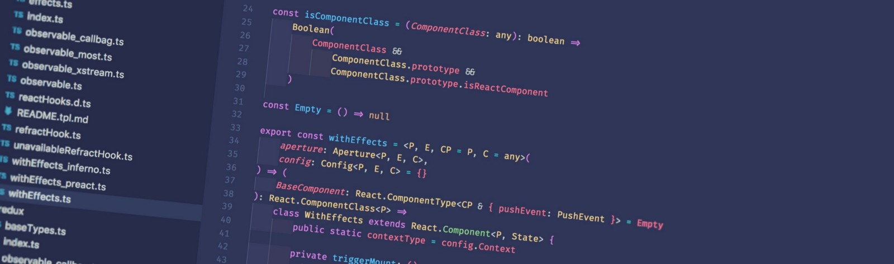

Have you ever wondered how open-source libraries built by companies come into existence?

I've always been curious about it. Do they start with the intention of creating an internal library? Is open-source the initial goal? If neither, how does it happen at all? Now that I've been lucky enough to see that through from start to finish, it feels worth sharing the story of how [Refract](https://refract.js.org) came to exist!

One of the first things I did after accepting [FanDuel's](https://www.fanduel.com/careers) job offer was email the engineers who had interviewed me.

My previous employer had been an ambitious startup working on some cool ideas, but FanDuel was the real deal: a tech unicorn with a reputation as one of the top companies in the country. Since I had only a few months' experience with React/Redux et al, it seemed a good idea to get a head-start… so I asked what tech to learn.

Among libraries and concepts both familiar and unfamiliar, one line in the reply caught my attention:

> "xstream - we are very excited about using reactive programming"

I had heard of reactive programming - it was exactly the kind of powerful, flexible programming technique I was hoping to learn. However, I knew enough about it that the name xstream raised questions.

Generally, the combination of React and reactive programming meant redux-observable, and redux-observable used RxJS. Xstream is an alternative to RxJS. The fact that they used xstream meant either an adaptor or some kind of custom integration.

I hoped it was the latter. It fit with the company's reputation for innovation, and felt like something which could be immensely interesting to work on.

I would not be disappointed.

## A Time For Exploration

There are advantages and disadvantages to starting a new job in mid-December. They are amplified if your first week happens to be a hackathon.

It would be a while before serious work would be sent my way, which in my case was a good thing. It meant I had time to explore. One quirk of my approach to learning is that I'm happy absorbing knowledge and context about a new codebase by simply reading the code.

My main goal was to understand the app from a general perspective, but I had other questions. I wanted to see how they used reactive programming - and it didn't take long to find what I was looking for.

Digging through several layers of abstraction led to a pair of higher-order components: `withSideEffects` and `withPropsSideEffects`.

The former allowed you to observe a Redux store via actions or selectors. It was like redux-observable in concept, but embedded into a React component.

The latter was even more interesting. It allowed you to observe the data flowing through React itself, something I had never even heard of as a possibility.

These two generalised HoCs formed the building blocks for a selection of more specialised ones. Each took a stream of data and performed a specific side-effect in response. One pair to dispatch analytics events, another pair to dispatch to the store. Yet another to trigger navigation changes. This was an obvious limitation: you could observe only one source at a time and cause only one type of effect.

Another flaw was that the HoCs had a very cryptic API. To configure them you had to pass in nested arrays, containing lists of things you wanted to observe and effects you wanted to cause in response.

As a result, this hugely powerful feature was not used to its full potential. The ideas behind the code showed so much flexibility, but those flaws were holding it back.

So where did the flaws come from? What battles had this code weathered before it came to bear those scars?

It turns out that the code I first encountered was actually iteration number four. What were the earlier iterations, and how did they come to pass?

## Many Eons Ago

In 2015, FanDuel made the decision to create a new product for a potential new market. It was treated as a fresh start - a chance to try something new, to explore the potential advantages the popular React/Redux ecosystem might offer over the existing Angular app.

[Thomas](https://twitter.com/tcroch) was one of the lead engineers on the project. He was convinced that reactive programming could unlock huge benefits, keen to find opportunities to use it in the app.

The first seeds of Refract - the first iteration - came from every developer's absolute _favourite_ thing to work on: analytics.

We won't explore this version here, because at the time Thomas wrote [an article explaining the situation](http://troch.github.io/posts/2016/09/27/redux-analytics-without-middleware/) which remains well worth reading. The core of the feature involved streams embedded into a React component. It let you observe actions and selectors, and send data to analytics vendors in response.

## The Steady March Of Progress

The new app was considered a success, and the company decided to re-platform the flagship US product using the shiny new technology.

As is natural with such major changes to a product already used at scale, this would be a long-term project. At time of writing, several Angular views remain in use, and some even older legacy code clings to life in places.

But that does not mean that life waits for the old code to catch up. Over time, the approach to side-effects evolved and improved.

The second iteration of Refract will remain lost in time. To quote Thomas, _"I've forgotten, and I think it's better that way."_

The third iteration was similar to the approach I first encountered. Its API was even harder to read, and it was still limited to observing Redux.

The fourth iteration was a big leap. The ability to observe React props was introduced. Minor inconsistencies were ironed out. The imperative and declarative code was split into something akin to Redux's reducers and action creators.

This iteration was stable for over a year. It proved its value over time, and was considered a mature feature by the time I joined.

## A New Idea

So, Refract started off as some proprietary code, considered stable but difficult to use, built inside a large app. How did we turn that into a self-contained library, ready for use by the wider community? What steps were taken along the way?

The project was actually sparked by an outside influence. FanDuel often hosts the [Edinburgh React](https://www.meetup.com/react-edinburgh/) meetups, with at least one or two engineers attending.

At one meetup, a talk explored redux-observable, and it struck one of the people present just how much more our code could do in comparison. We talked about it over the following weeks, feeling that it would be something well worth open-sourcing.

For a while, nothing seemed to come of these discussions. While the company dedicates 10% of everyone's time for professional development, everyone had other things they wanted to work on. Besides, the code seemed too complex for it to be a project which could actually succeed.

## It's Happening?

Then, one day in mid-April, a new slack channel appeared. The channel's purpose: `Discussion of a new API for side-effects, with OSS plan`. Thomas posted a sketch of a new API he had in mind.

The sketch was a lot simpler than the existing API. It made the developer experience much cleaner and more intuitive, and added even more flexibility. Over the following weeks we discussed ideas for improvements, while getting on with the serious business of bike-shedding on the name and logo for the project.

For a while we converged on the name **Recoil** without being too happy with it, but then the perfect name was suggested: **Refract**. Symbols were sketched, and then the final logo was completed. Progress!

With the serious work out of the way, we could get on with the remaining details - namely waiting for Thomas to write the code.

He extracted the existing code from the app, and tweaked it to match the new API design. We took the time to build some test projects, iterate on the details, and then write the documentation and examples. We pitched the idea to our CTO and other executives, gaining approval from a number of key stakeholders.

So there you have it: at least in this case, our library has a much longer history than it may seem. It grew through many iterations before the first hints of open-source came to mind.

We published version one of Refract at the end of August 2018, after using it internally for a while, and it has been a joy to work with. But, as with the best origin stories, the end is merely the beginning of something greater.

## A New Purpose

Our early experience using the library led us to some new ideas. We implemented the best of them, and Refract became something far more general purpose than we originally imagined.

It is no longer just a library for isolating side-effects from your synchronous logic. It now lets you **build your React app using reactive programming**. This has huge implications for how we might structure our apps in the future.

But that's best left to be explored another time.

For now, if you want to find out more, [check out our documentation](https://refract.js.org/) and our numerous [live code examples](https://refract.js.org/examples)!

Join us in our [**#refract** channel on the Reactiflux Discord server](https://discordapp.com/invite/fqk86GH) if you have any questions or feedback, or to just talk about how you'd like to use the library. We look forward to hearing from you!
